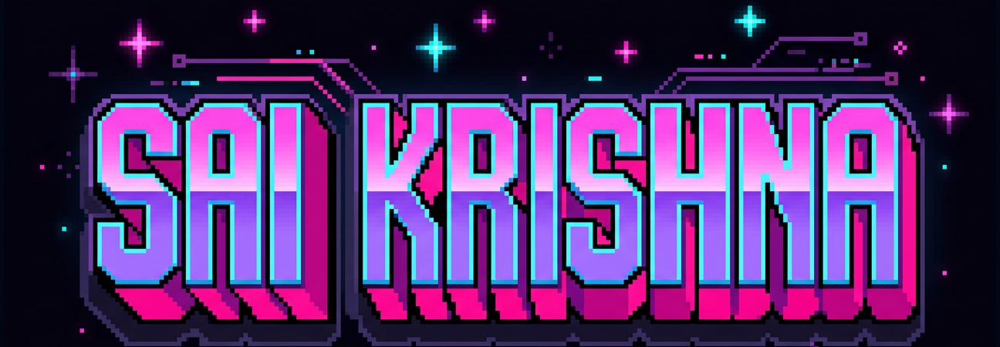

<!--
  GitHub profile README for @bodapatisaikrishna
  Repo: github.com/bodapatisaikrishna/bodapatisaikrishna
  Theme: Retro-Cyberpunk Terminal / High-Assurance AI & Systems Engineering
-->

<div align="center">
  
</div>

<br />

<div align="center">
  
</div>

<br />

<div align="center">
  <a href="https://git.io/typing-svg">
    
  </a>
</div>

<p align="center">
  <a href="https://www.linkedin.com/in/saikrishna-bodapati-5a5891321/" target="_blank">
    
  </a>
  <a href="mailto:saikrishnabodapati@gmail.com">
    
  </a>
  <a href="https://github.com/bodapatisaikrishna?tab=repositories">
    
  </a>
  
</p>

<p align="center">
  <a href="#about-me">About Me</a> &nbsp;•&nbsp;
  <a href="#runtime--stack">Tech Stack</a> &nbsp;•&nbsp;
  <a href="#verified-deployments">Projects</a> &nbsp;•&nbsp;
  <a href="#upstream-contributions">Open Source</a> &nbsp;•&nbsp;
  <a href="#active-research">Current Work</a> &nbsp;•&nbsp;
  <a href="#telemetry--stats">Activity</a> &nbsp;•&nbsp;
  <a href="#handshake">Connect</a>
</p>

---

<a id="about-me"></a>
### 👋 About Me

I'm an AI &amp; ML undergraduate at **Amrita Vishwa Vidyapeetham**, Coimbatore.

I love building machine learning systems that are **engineered like real products** (clean typed APIs, comprehensive test suites, reproducible one-command deploys) and **evaluated like serious research** (leakage-free data splits, honest ablation studies, statistical significance tests, and a transparent account of what *didn't* work).

Most of my day-to-day focus sits right where applied ML meets practical systems engineering:
- **Critical-infrastructure security**: Causal intrusion detection in power grids and industrial SCADA networks.
- **Agentic-AI governance**: Enforcing deterministic security boundaries (via OPA / Rego) around autonomous LLM agents.
- **Payments &amp; financial reconciliation**: High-throughput ledger matching with microsecond latencies and zero margin of error.
- **Compiler internals**: Digging into PyTorch Dynamo, `torch.compile`, and operator lowering.

> 💡 *Guiding Invariant*: **"If a model loses to its own simple baseline, my READMEs say so right on the front page alongside the headline number."**

---

<a id="runtime--stack"></a>
### 💻 System Environment &amp; Tech Stack

```bash
saikrishna@node-01:~/stack$ cat languages_and_scripting.txt
```


```bash
saikrishna@node-01:~/stack$ ./init_ml_environment.sh --eval-mode
```


<details>
<summary><b>Modeling &amp; Theoretical Tooling</b></summary>
<br/>


</details>

```bash
saikrishna@node-01:~/stack$ ./serve_infrastructure.sh --protocol=mcp
```


```bash
saikrishna@node-01:~/stack$ ./audit_security_stack.sh
```


---

<a id="verified-deployments"></a>
### 🚀 Featured Systems &amp; Projects

```bash
saikrishna@node-01:~/projects$ ls -la --sort=impact
```

#### 🛡️ [ACDE: Agentic Cloud Pipeline Governance](https://github.com/bodapatisaikrishna/agentic-cloud-pipeline-governance)
*Policy-bounded agentic governance for distributed cloud pipelines.*
<br/>


Autonomous AI agents can fix broken data pipelines on the fly, but letting an LLM execute arbitrary shell or SQL commands in production is reckless. I built ACDE to enforce safety through architecture rather than prompt alignment: four specialized agents continuously monitor pipeline telemetry and *propose* remediation steps, but an Open Policy Agent (OPA) gate evaluates every proposed mutation against deterministic security policies before anything runs. Replicated and extended an arXiv research paper with a dedicated adversarial containment evaluation suite.
&nbsp;•&nbsp; **556 unit tests · Adversarial containment measured at 1.0 (zero policy leaks)**

---

#### 💳 [Kosh: AI Finance Controller](https://github.com/bodapatisaikrishna/kosh)
*Three-way payment settlement reconciliation, tied out to the exact paisa.*
<br/>


Built for the **Razorpay AI Buildathon 2026**. Kosh reconciles high-volume financial transactions across customer orders, payment gateway ledgers, and bank statements in ~40 ms for 10,000 records. It follows a strict deterministic-first philosophy: fast vector math and heuristic rules settle 99.5%+ of entries instantly, while a tool-using LLM agent is only ever invoked for the messy &lt;0.5% edge cases that need contextual reasoning. Designed with zero external runtime dependencies.
&nbsp;•&nbsp; **257 tests · 0.00% false-match rate across 11 random seeds &amp; 7 adversarial test cases**

---

#### ⚡ [CyberPhysicalDBN](https://github.com/bodapatisaikrishna/CyberPhysicalDBN)
*Causal intrusion detection for smart power grids: learned, not hand-tuned; closed-loop, not open.*
<br/>


Standard intrusion detection systems in smart grids treat telemetry like arbitrary time-series data, completely ignoring underlying physical grid equations. In this project, a Graph Neural Network (GNN) perception layer feeds into a Dynamic Bayesian Network, with `pandapower` simulating real physical electrical loop feedback. To rigorously stress-test its resilience, I trained a reinforcement learning (PPO) adversarial attacker specifically tasked with dodging the detector. Extends an *IEEE Access* publication with 12 pre-registered experiments, keeping and reporting all negative results.
&nbsp;•&nbsp; **530 tests · 12 pre-registered experiments · Full adversarial RL evaluation**

---

#### 🔍 [DomainExpansion.ai](https://github.com/bodapatisaikrishna/domainexpansion)
*MCP-native API attack-surface &amp; BOLA vulnerability detection engine.*
<br/>


Detects Broken Object Level Authorization (BOLA), hidden endpoints, and credential enumeration by analyzing messy raw API access logs into concrete, citable security evidence. Rather than hallucinating findings, it executes seven deterministic detection heuristics exposed as a full Model Context Protocol (MCP) server. Validated against a real 50,000-line third-party production log corpus.
&nbsp;•&nbsp; **111 tests · 11 MCP tools · 6 resources · 4 prompts**

---

#### 🌾 [AgriIntelligence](https://github.com/bodapatisaikrishna/agri-intelligence)
*Explainable precision-farming platform: 13 decision modules behind a unified service.*
<br/>


Most machine learning tools in agriculture act as black boxes that growers cannot verify. AgriIntelligence packages 13 agronomic models behind a clean FastAPI service, attaching SHAP or Grad-CAM explanations to every single recommendation so users understand the *why*. Features strict leakage-free temporal splits, Diebold-Mariano statistical significance tests, and an automated script that compiles an IEEE-style paper directly from trained checkpoints.
&nbsp;•&nbsp; **68 tests · Deployed with Docker on Hugging Face Spaces**

---

#### 🔒 [Resilient Cybersecurity in Smart-Grid ICS Communication](https://github.com/bodapatisaikrishna/Resilient-Cybersecurity-in-Smart-Grid-ICS-Communication)
*Multi-layer security stack for IEC 60870-5-104 industrial SCADA networks.*
<br/>


Legacy industrial SCADA systems often transmit sensitive grid control messages in unencrypted plaintext. I engineered a defense stack combining time-keyed AES-256 encryption with automated 60-second key rotation, paired with an XGBoost intrusion detector trained with SMOTE over 411,000 traffic packets. Validated against active cryptographic attack vectors (CCA, CPA, COA, KPA) on the BUT-IEC104-I benchmark dataset.

---

<a id="upstream-contributions"></a>
### 🌐 Upstream Open-Source Contributions

```bash
saikrishna@node-01:~/oss$ git log --oneline --grep="MERGED" --tier-1
```

I'm an active open-source contributor and enjoy fixing performance bottlenecks and security vulnerabilities in the tools I use every day. Here are some key pull requests I've had merged upstream:

| Pull Request | Repository | What Was Solved &amp; Why It Matters |
|:---:|---|---|
| [#132860](https://github.com/grafana/grafana/pull/132860) |  `grafana/grafana` | **[Core Performance]** Diagnosed and eliminated catastrophic regular expression backtracking (`\B` alternation) in Loki log key parsing, achieving a **5,000x speedup** on adversarial inputs. |
| [#2200](https://github.com/NVIDIA/garak/pull/2200) |  `NVIDIA/garak` | **[Core LLM Red-Teaming]** Corrected prompt setters in paraphrase buffs to maintain conversation history and preserve `Conversation` type integrity during vulnerability scans. |
| [#4892](https://github.com/huggingface/huggingface_hub/pull/4892) |  `huggingface/huggingface_hub` | **[Security Hardening]** Hardened `repo_id` validation by restricting character patterns strictly to ASCII word characters, eliminating subtle naming ambiguities. |
| [#4884](https://github.com/huggingface/huggingface_hub/pull/4884) |  `huggingface/huggingface_hub` | **[Security Hardening]** Prevented directory traversal attacks by explicitly rejecting embedded `..` path segments in repository files. |
| [#6858](https://github.com/optuna/optuna/pull/6858) |  `optuna/optuna` | **[Docs &amp; Quality]** Removed obsolete `ChainerMNStudy` references and corrected broken Sphinx roles in the official documentation. |
| [#6850](https://github.com/optuna/optuna/pull/6850) |  `optuna/optuna` | **[Docs &amp; Quality]** Fixed outdated trial failure and NaN reporting examples in the FAQ to prevent user confusion. |

---

<a id="active-research"></a>
### 🔬 What I'm Exploring Right Now

```bash
saikrishna@node-01:~/current$ cat what_im_working_on.md
```

- **Production ACDE Hardening**: Developing a multi-tenant isolation layer and policy sandbox for enterprise agentic pipeline governance.
- **Causal vs. Deep-IDS Under Attack**: Researching whether causal Bayesian representations retain higher adversarial robustness than deep neural detectors under an adaptive RL adversary.
- **klaim**: Building an evidence-first algorithmic tool to help quick-commerce vendors contest and reverse unjustified marketplace deductions.
- **PyTorch Compiler Internals**: Reading through the `torch.compile` / Dynamo codebase, studying `SliceVariable` handling, guard generation, and operator lowering.

---

<a id="telemetry--stats"></a>
### 📊 Activity &amp; Telemetry

```bash
saikrishna@node-01:~/telemetry$ watch -n 1 streak_monitor
```

<p align="center">
  
</p>

<p align="center">
  <sub>Full contribution graph and commit history are displayed on the profile page above this terminal.</sub>
</p>

---

<a id="handshake"></a>
### 🤝 Let's Connect

```bash
saikrishna@node-01:~$ ./ping --contact saikrishna
```

Whether you'd like to discuss agentic AI safety, causal ML in critical infrastructure, open-source work, or explore potential research/internship roles, feel free to reach out!

<p align="center">
  <a href="https://www.linkedin.com/in/saikrishna-bodapati-5a5891321/" target="_blank">
    
  </a>
  &nbsp;
  <a href="mailto:saikrishnabodapati@gmail.com">
    
  </a>
  &nbsp;
  <a href="https://github.com/bodapatisaikrishna">
    
  </a>
</p>

<div align="center">
  
</div>
